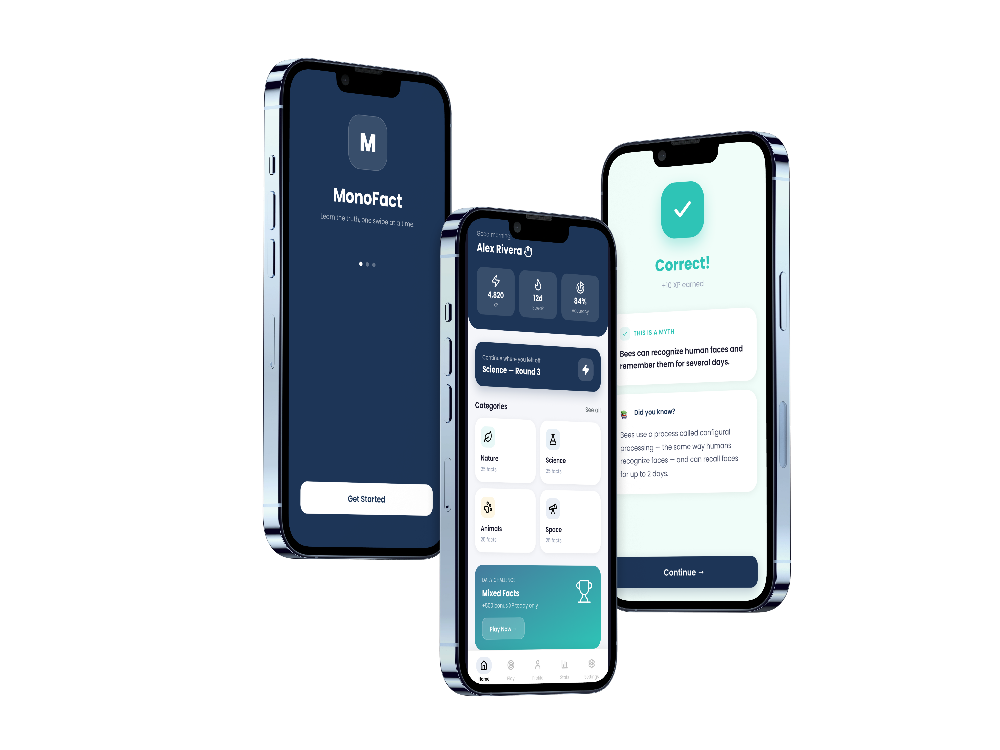

# MonoFact 

<div align="center">



### *Test your intuition. Discover the truth.*

A modern, swipe-based educational quiz application built with **React Native**, **Expo**, and **Firebase**.

[](https://reactnative.dev/)
[](https://expo.dev/)
[](https://www.typescriptlang.org/)
[](https://firebase.google.com/)
[](LICENSE)

[ Watch Demo Video](https://drive.google.com/drive/folders/1cpskZdVN8eDnTDrasaUTKInUQez0y?usp=sharing) · [ Project Documentation](#-documentation) · [ Getting Started](#-getting-started)

---

</div>

##  About MonoFact

**MonoFact** is a cross-platform educational mobile app inspired by modern gamified learning experiences. 

Users are presented with statements and must swipe **Right** if they believe it is a **Fact** or **Left** if it is a **Myth**. With immediate interactive feedback, streak multipliers, rich sound & haptic feedback, an exponential level progression system, and a suite of 27 unlockable achievements, learning becomes addictive and rewarding.

---

##  Key Features

-  **Intuitive Gesture Gameplay:** Fluid card swiping mechanics powered by React Native Gesture Handler & Reanimated.
-  **6 Knowledge Decks:** Comprehensive fact pools across Nature, Science, Animals, Space, Photography, and Technology.
-  **Daily Challenge:** A unique set of 5 mixed-topic facts every 24 hours awarding +500 bonus XP.
-  **Streak Multiplier & Dynamic XP:** Earn progressive bonus XP for consecutive correct answers (up to 9x streak bonus).
-  **Achievement Engine:** 27 unlockable badges across 8 categories (Streak, Score, Level, Games, Explorer, Daily, Swipe, and Hidden).
-  **Real-Time Analytics:** Track accuracy, category mastery, total games played, and completion rate.
-  **User Profiles & Customization:** Secure authentication, avatar upload support, and real-time cloud data sync via Firebase.
-  **Sleek Custom Design System:** Curated dark/light accessible palette, refined typography, and responsive layouts.

---

##  Gameplay Systems

###  XP & Progression Formula
* **Base Reward:** `15 XP` per correct answer.
* **Streak Bonus:** `Streak Count × 10 XP` (capped at streak 9 for `+90 XP` bonus).
* **Daily Challenge:** `+500 XP` upon round completion.
* **Exponential Levelling:** Level progression dynamically scales using an exponential curve:
  $$\text{XP Required for Level } n = \lfloor 100 \times 1.8^{(n - 1)} \rfloor$$

###  Achievements (27 Unlockables)
| Category | Achievements | Description |
|---|---|---|
|  **Streak** | *First Spark, On Fire, Unstoppable, Legendary* | Maintained high-accuracy answer streaks |
|  **Score** | *Perfect Round, Sharp Mind, Flawless* | Mastered game rounds with zero mistakes |
|  **Level** | *First Steps, Rising Star, Fact Machine, Enlightened* | Reached milestone level tiers |
|  **Games** | *Rookie, Dedicated, Veteran, Elite* | Played total games milestones |
|  **Explorer** | *Curious Mind, Explorer, Globetrotter, Completionist* | Discovered and completed multiple categories |
|  **Daily** | *Daily Devotee, Consistent, Dedicated Scholar* | Played daily challenges consistently |
|  **Swipe** | *Quick Draw, Swipe Master* | Speed and swiping volume milestones |
|  **Hidden** | *Secret Achievements* | Special hidden conditions revealed on unlock |

---

##  Tech Stack & Architecture

| Layer | Technology | Role |
|---|---|---|
| **Framework** | [React Native](https://reactnative.dev/) | Cross-platform native runtime |
| **Tooling & Router** | [Expo](https://expo.dev/) (SDK 54) & Expo Router | File-based navigation and universal native runtime |
| **Language** | [TypeScript](https://www.typescriptlang.org/) | End-to-end type safety and maintainability |
| **Backend & Auth** | [Firebase](https://firebase.google.com/) (Firestore & Auth) | User identity, persistent stats, and cloud database |
| **Gestures & Animations** | `react-native-gesture-handler` & `react-native-reanimated` | High performance 60fps swipe gestures |
| **Icons** | [Lucide React Native](https://lucide.dev/) | Modern and clean iconography |

---

##  Project Structure

```text
MonoFact/
├── app/
│   ├── (tabs)/              # Primary navigation tabs (Home, Play, Profile, Stats, Settings)
│   ├── auth/                # Authentication screens (Login, Register)
│   ├── context/             # Global state (UserContext, AuthContext)
│   ├── game/                # Active gameplay flows (Category Quiz, Daily Challenge, Results)
│   └── services/            # Firebase config, stats calculations, and user operations
├── components/
│   ├── buttons/             # Primary and secondary button components
│   ├── cards/               # Reusable card UI (Achievement, Question, Stats, Answer)
│   ├── gameplay/            # Swipeable cards, progress bars, answer hints
│   └── layout/              # SafeArea containers, headers, and navigation bars
├── constants/               # Design tokens (Colors, Typography, Spacing, Theme)
├── data/facts/              # Raw JSON dataset categorized by topic
├── documents/               # Wireframes, branding guide, and project planning docs
└── scripts/                 # Firestore seed and database migration scripts
```

---

##  Getting Started

### Prerequisites
* [Node.js](https://nodejs.org/) (v18.x or later recommended)
* [Expo Go](https://expo.dev/go) app on your iOS / Android device or an Emulator

### 1. Clone the Repository
```bash
git clone https://github.com/FrancoisleRouxDev/MonoFact.git
cd MonoFact/MonoFact
```

### 2. Install Dependencies
```bash
npm install
```

### 3. Configure Environment Variables
Create a `.env` file in the `MonoFact/` directory with your Firebase configuration:

```env
EXPO_PUBLIC_FIREBASE_API_KEY=your_api_key
EXPO_PUBLIC_FIREBASE_AUTH_DOMAIN=your_auth_domain
EXPO_PUBLIC_FIREBASE_PROJECT_ID=your_project_id
EXPO_PUBLIC_FIREBASE_STORAGE_BUCKET=your_storage_bucket
EXPO_PUBLIC_FIREBASE_MESSAGING_SENDER_ID=your_messaging_sender_id
EXPO_PUBLIC_FIREBASE_APP_ID=your_app_id
EXPO_PUBLIC_FIREBASE_MEASUREMENT_ID=your_measurement_id
```

### 4. Seed the Database
Populate your Firestore instance with the starter fact pool:

```bash
npm run seed
```

### 5. Launch the Development Server
```bash
npm start
```
Scan the QR code with your mobile camera (iOS) or the **Expo Go** app (Android).

---

##  Available Scripts

Inside the `MonoFact/` directory:

| Command | Action |
|---|---|
| `npm start` | Starts the Expo development server |
| `npm run android` | Builds and opens the app on Android |
| `npm run ios` | Builds and opens the app on iOS Simulator |
| `npm run web` | Launches the app in the web browser |
| `npm run lint` | Runs ESLint across the application code |
| `npm run seed` | Seeds Firestore with the question decks |

---

## Documentation

Full project deliverables and documentation are available in the [`documents/`](file:///c:/Users/flr21/Desktop/MonoFact/MonoFact/documents) folder:
* **[Branding & Design System](file:///c:/Users/flr21/Desktop/MonoFact/MonoFact/documents/branding)** — Color tokens, typography, and UI guidelines.
* **[Wireframes & Architecture](file:///c:/Users/flr21/Desktop/MonoFact/MonoFact/documents/wireframes)** — Screen flows and navigation hierarchy.
* **[Planning & Database Design](file:///c:/Users/flr21/Desktop/MonoFact/MonoFact/documents/planning)** — Firestore schema specifications and milestone tracking.

---

## Acknowledgements

Special thanks to:
- **Tsungai Katsuro** — lecturer, for guidance and support throughout this project
- **Anthropic Claude** — AI assistant used during development for logic design, debugging, and implementation support
- **Expo** — for the React Native toolchain and development environment
- **Firebase** — for real-time database, authentication, and storage infrastructure
- **Lucide** — for the open-source icon library used throughout the UI

---

## 📄 License

This project was developed for educational purposes as part of the Bachelor of Creative Technologies programme at **The Open Window Institute**.